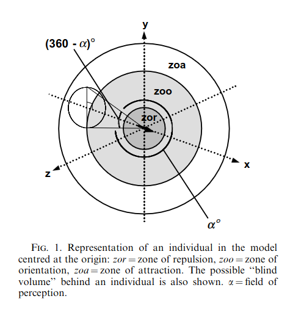

# Introduction

```{r}
#| include: false
targets::tar_source('R')
```

Animal social dynamics have broad implications in ecology including resource
availability, disease transmission and collective behaviour. Social network
analysis can measure the structure of social systems, the consequences of an
individual's position in a network, the spread of disease or information across
networks, and the influence of the environment [@Farine_2015]. Open source tools
have been developed to derive social networks from animal telemetry data
[@Robitaille_2019] using aggregated association rates or home range overlap. The
methods have been used to measure contact rates to measure social cohesion
[@Bracken_2022], human-wildlife conflict [@Boudreau_2022], socioecology and
resource availability [@Peignier_2019],  community structure [@Sunga_2021],
influence of stress of social proximity [@Keshavarzi_2023], social patterns in
non-social species [@Heeres_2024].

Many facets of group living need to be measured to better understand animal
social systems [@King_2018]. There are additional types of dyadic relationships
including genetic, affiliative, agonistic, and cooperative [@Farine_2015]. There
are also interactions between spatial and social phenotypes and environments
[@Webber_2023]. Using direct observations, researchers have studied intragroup
social dynamics including social foraging [@Barnard_1981; @Giraldeau_1986;
@Hirsch_2020], spatial position within groups [@Krause_1994; @Monus_2008] and
the influence of individual traits such as age, sex and dominance
[@Furuichi_1983; @King_2009; @Teichroeb_2015]. Unfortunately, direct
observations can be labor-intensive to collect and susceptible to observer bias
[@Smith_2021], with low spatial and temporal resolution making them imperfect
for studies of collective movement [@King_2018].

There are expanded opportunities to understand animal social systems by pairing
advances in remote tracking technology with emerging approaches to measuring
intragroup social dynamics. The availability and resolution of remote tracking
data continues to improve [@Kays_2015; @Kays_2022; @Nathan_2022]. There are over
two decades of research on measuring the interaction between moving individuals
from the study of "moving point objects" in GISciences [@Andersson_2008;
@Dodge_2008; @Laube_2005] to group coordination of moving groups [@Couzin_2002;
@Herbert-Read_2011] and leadership and decision making [@King_2011; @Nagy_2010;
@Strandburg-Peshkin_2015]. Despite this, we suggest the availability of open
source tools [@Hampton_2015; @Powers_2019; @Wilson_2017] is the missing piece
between the call to integrate technology enhanced research with
multidisciplinary approaches to better understand animal social systems
[@Couzin_2023; @King_2018].

Here we present 
`r length(grep('cent|dir|dista|ali|del|zon|lead|get', ls('package:spatsoc')))`
new functions for the R package {spatsoc} [@Robitaille_2019] for measuring
intragroup dynamics. We conducted a scoping review to identify metrics
applicable to spatiotemporal data used in ecological studies focused on dyadic
interactions, dominance hierarchies and leadership patterns (Sup A, B). Of the
resulting metrics, we selected those with a high number of citations (as a
measure of value for the target audience) and unavailability in the R
programming language, either through R packages or supplemental materials in the
literature. We will demonstrate these new functions through a case study and
discuss biological interpretation.

<!-- update count if include randomization method --> 

# Methods

## Selecting metrics

**TODO**

<!--
Criteria: 

- highly cited, unavailable
- direct extension of available functions in spatsoc
- biology


For each

- Citation
- Interpretation, **emphasis on biology**
- Formula
- Code example
- Similar terms? eg. see metric synonyms

See list of not selected metrics (Supplement  B), including already available 
functions in eg. {wildlifeDI}, metrics relating to posture,
static interaction eg. home range overlap, ...

-->

## Directional correlation delay

The directional correlation delay [@Nagy_2010] of individuals i, j is 

$$C_{ij} = [\overrightarrow{v_{i}}(t) * \overrightarrow{j}(t + \tau)]_{t}$$

where 

- $\overrightarrow{v_{i}}(t)$ is the normalized velocity of bird i at time t
- $\overrightarrow{v_{j}}(t + \tau)$ is the normalized velocity of bird j at time t + $\tau$
- Note that $C_{ij}(\tau)$ = $C_{ji}(-\tau)$
- Calculated only where pairs of individuals were less than 100 m apart


The maximum value of the directional correlation function $C_{ij}$ is at
$C_{ij}(\tau^{*}_{ij})$ where $\tau^{*}_{ij}$ is the directional correlation
delay time. $\tau^{*}_{ij}$ values focus on the relationship in pairs of
individuals, ignoring hierarchy changes caused by other individuals.

- Note that $\tau^{*}_{ij}$ = $-\tau^{*}_{ji}$
- Negative values indicate that flight directional changes of bird i fall behind
that of bird j and therefore j is leading

Hierarchical networks can be generated using $\tau^{*}_{ij}$


## Position within group, rank position within group, time spent leading group, distance and direction to leader

The position within group is the position along the front-to-back axis of the
group's direction (eg. [@Quera_2023; @Harel_2021]). The rank position within group
is the ordinal rank along the front-to-back axis of the group's direction (eg.
[@Burns_2012]). The time spent leading group is an aggregate metric of the time
in the first rank position within group. The distance to leader is the 
geographic distance to the focal individual's group leader. The direction to 
leader is the absolute direction to the focal individual's group leader. 

<!-- 
- front-back distance along group's axis of movement [@Quera_2023]
- ordinal 1-6 position along group's traveling direction [@Burns_2012]
- relative positional ranks on the front-to-back axis were determined 
by multiplying their x–y locations by a rotation matrix based on the heading 
of the centroid [@Harel_2021]
- space transformation from geographical space to relative positions with respect
to group center and movement direction [@Andrienko_2013]


- note group leader defined using {spatsoc} functions, or manually, 
using focal obs or other tools

- group = distance threshold
- at each step
- ?how to compare rank across varying sized groups
-->

## Distance, direction and rank distance to group centroid

The group centroid is the mean of individual locations in a group. The
distance to group centroid is the distance between an individual's location
and the group centroid. The direction to group centroid is the absolute
direction from an individual's location and the group centroid. The rank distance
to group centroid is the ordinal rank of individuals' distances from the 
group centroid. 


## Polarization, directional alignment and interindividual direction

Polarization measures the uniformity of directions in a group of individuals 
[@Wang_2022] on a scale of 0-1 where values near 0 indicate that directions point
in different directions and values near 1 indicate that directions point in 
similar directions. 

```{r}
#| echo: true

# Random directions (radians)
h <- runif(25, 0, 2 * pi)

library(swaRm)
pol_order(h)

library(CircStats)
r.test(h)

# Also interesting
circ.range(h)
```

Directional alignment measures the pairwise differences in direction between
individuals. Interindividual direction measures the pairwise directions
between individual locations. 

```{r}

# TODO

```


## Behavioural zones

The behavioural zones metric metric assigns neighbours to three non-overlapping
behavioural zones [Couzin_2002]. The "zone of repulsion" is the minimum distance
around an individual within which neighbours are expected to move away to 
avoid collisions. The "zone of orientation" is the next zone around an 
individual beyond the "zone of repulsion" within which neighbours are expected
to orient themselves to the movement of their neighbours. The "zone of
attraction" is the last zone around an individual within which neighbours are 
expected to be attracted to the position of the focal individual. Notably, 
there is a possibly "blind volume" behind the individual representing the limits
of their perception. 




## Fission fusion

Given the variability in defining fission fusion dynamics in the literature
(Supplement B), we developed a flexible function that allows users to both use
their system specific definitions and at the same time easily compare to results
to other definitions.

Arguments: 

- Minimum run length indicating the number of successive fixes that are required 
to establish a fusion event
- Maximum missed observations indicating the number of allowable missed 
observations for either individual in a dyad within a fission event
- Threshold distance to define a fusion event


# Case study

Functionality previously available in {spatsoc} includes spatiotemporal grouping,
edge list generation and data-stream permutations (Robitaille et al. 2019). 
These functions have allowed users to detect interactions between individuals, 
measure coocurrence within and across species, and generate social networks
from telemetry data. (TODO: cite examples citing spatsoc)

Spatiotemporal grouping can be performed given a telemetry dataset, 
temporal and spatial thresholds, and one of three grouping functions:
`group_pts`, `group_lines` or `group_polys`. Each return a unique identifier
for each spatiotemporal group, defined using point based distances, 
linear trajectory overlap or home range overlap, respectively. 


For example, the suggested `group_pts` workflow 
with example data from the package: 

```{r}
#| eval: false
#| echo: true

# Load packages
library(data.table)
library(spatsoc)

# Read example data
DT <- fread(system.file("extdata", "DT.csv", package = "spatsoc"))

# Cast the character column to POSIXct
DT[, datetime := as.POSIXct(datetime, tz = 'UTC')]

# Set variables
temporal_threshold  <- '20 minutes'
spatial_threshold <- 50
id <- 'ID'
coords <- c('X', 'Y')
utm <- 32736

# Setup DT for geometry interface
get_geometry(DT, coords = coords, crs = utm)

# Temporal grouping
group_times(DT, datetime = 'datetime', threshold = temporal_threshold)

# Spatial grouping with timegroup
group_pts(DT, threshold = spatial_threshold, id = id,
          coords = coords, timegroup = 'timegroup')
```

```{r}
#| echo: false
DT <- tar_read(spatial_groups)
tinytable::tt(DT[order(timegroup)][1:5])
```

Users can also measure dyadic interindividual distance using the `edge_dist`
function and identify nearest neighbors using the `edge_nn` function. For
example:

```{r}
#| echo: true
#| eval: false
interindividual_dist <- edge_dist(
  DT,
  threshold = spatial_threshold,
  id = id,
  timegroup = 'timegroup',
  returnDist = TRUE,
  fillNA = TRUE
)
dyad_id(interindividual_dist, id1 = 'ID1', id2 = 'ID2')
```

```{r}
#| label: "IID"
#| echo: false
#| eval: true
tinytable::tt(tar_read(distance_edges)[1:5])
```

```{r}
#| echo: true
#| eval: false
nearest_neighbours <- edge_nn(
  DT,
  id = id,
  timegroup = 'timegroup',
  returnDist = TRUE
)
dyad_id(nearest_neighbours, id1 = 'ID1', id2 = 'ID2')
```

```{r}
#| label: "nn"
#| echo: false
#| eval: true
tinytable::tt(tar_read(nn_edges)[1:5])
```

Building on these functions, {spatsoc}'s new functionality provides 
a finer understanding of an individual's behaviour with respect to conspecifics. 
We aim to provide users with accessible, flexible functions that will 
help them identify leader follower patterns, fission fusion dynamics and 
potentially dominance behaviours in their own animal telemetry data. 

## Position within groups

Extending {spatsoc}'s abilities to identify spatiotemporal groups, a new 
set of functions are now available to measure individuals position relative within
spatiotemporal groups. 

After identifying spatiotemporal groups with eg. `group_pts`, we 
can measure the group centroid. The group centroid is defined as the 
the mean of individual locations in a group.
<!-- TODO: describe spatial measures -->

```{r}
#| eval: false
#| echo: true
centroid_group(DT)
```

```{r}
#| eval: true
#| echo: false
tar_load(group_centroids)
tinytable::tt(group_centroids[1:5, .(ID, datetime, timegroup, group, geometry, centroid)])
```

Then we can measure each individual's direction and distance to the group centroid. 
The distance to group centroid is the distance between from the focal
individual to the group centroid. The direction to group centroid is the absolute
direction from the focal individual to the group centroid. The rank distance
to group centroid is the ordinal rank of individuals' distances to the 
group centroid. 
<!-- TODO: describe spatial measures -->
<!-- TODO: insert refs with examples of biological interpretation of distance and direction to  -->
<!-- group centroid.  -->

```{r}
#| echo: true
#| eval: false
distance_to_centroid(DT, return_rank = TRUE)
direction_to_centroid(DT)
```

```{r}
#| echo: false
#| eval: true
#| warning: false
#| fig-cap: "Position within group"
tar_read(fig_pos_wi_group)
```

After considering how individuals are positioned relative to the group centroid, 
we can also measure how individuals are positioned relative to the mean 
group direction. To do so, we rotate the coordinate system around the 
group centroid by the mean direction of all individuals in the group. Then 
we take the distance along this new axis to the measure of front-back position
within the group. 
<!-- TODO: describe spatial measures -->
<!-- TODO: refs where this is used, extended biological interpretation -->

The position within group is the position along the front-to-back axis of the
group's direction (eg. [@Quera_2023; @Harel_2021]). The rank position within group
is the ordinal rank along the front-to-back axis of the group's direction (eg.
[@Burns_2012]). The time spent leading group is an aggregate metric of the time
in the first rank position within group. The distance to leader is the 
geographic distance from the focal individual to the group's leader. The direction to 
leader is the absolute direction from the focal individual to the group's leader. 

<!-- TODO: describe spatial measures -->

```{r}
#| eval: false
#| echo: true
direction_step(DT, id = id)
leader_direction_group(DT, return_rank = TRUE)
```

```{r}
#| eval: true
#| echo: false
#| fig-cap: "Position within group"
tar_read(fig_pos_group_dir)$positions
```

```{r}
#| eval: true
#| echo: false
#| warning: false
#| fig-cap: "Distance and direction to leader direction group"
tar_read(fig_pos_group_dir)$dist_dir
```

## Position relative to leader

Taking a simple, dynamic definition of leadership, we can identify the 
distance and direction of each individual to the leader of each spatiotemporal
group. 

```{r}
#| eval: false
#| echo: true
distance_to_leader(DT)
direction_to_leader(DT)
```


```{r}
#| eval: true
#| echo: false
tar_read(fig_dist_dir_leader)
```


## Fission fusion

Given the variability in defining fission fusion dynamics in the literature, we
developed a flexible function that allows users to both use their system
specific definitions and at the same time easily compare to results to other
definitions. 

Function arguments: 

- `threshold`: spatial distance threshold to establish a fusion event
- `n_min_length`: the minimum number of successive fixes that are required to 
establish a fusion event
- `n_max_missing`: the maximum number of allowable missed observations for 
either individual in a dyad within a fusion event
- `allow_split`: if fusion events allow a temporary spatial splitting for one
observation without resulting in a fission event

<!-- See Table Sup B: varying definitions of fission fusion -->

```{r}
#| eval: false
#| echo: true
# Fission fusion events using interindividual distance calculated with edge_dist
fusion_events <- fusion_id(
  interindividual_dist,
  threshold = spatial_threshold, 
  n_min_length = 0, 
  n_max_missing = 0, 
  allow_split = FALSE
)
```


```{r}
#| echo: false
#| eval: true
#| fig-height: 10
tar_read(fig_fusion_events)
```


## Directions

Next, we can use individuals' directions to explore interindividual direction,
directional alignment and group polarization.  
<!-- TODO: describe spatial measures -->

<!-- TODO: references -->
<!-- related eg. direction between individuals (always L / R), polarization of flock, -->
<!-- etc -->

Polarization measures the uniformity of absolute direction in a group of individuals 
[@Wang_2022] on a scale of 0-1 where values near 0 indicate that directions point
in different directions and values near 1 indicate that directions point in 
similar directions. 

```{r}
#| echo: true
#| eval: false
direction_polarization(DT)
```

```{r}
#| echo: false
#| eval: true
#| fig-height: 10
tar_read(fig_dir_polarization)
```

Directional alignment is the relative difference between two individuals' 
directions. Given the similarity to `edge_dist`, this functionality
is provided under a similar name: `edge_alignment`. 

```{r}
#| echo: true
#| eval: false
directional_align <- edge_alignment(
  DT = DT,
  id = id,
  signed = FALSE
)
```

Interindividual direction measures the absolute direction between individuals. 
<!-- TODO: describe spatial measures -->

```{r}
#| echo: true
#| eval: false
dyad_directions <- edge_direction(
  edges = interindividual_dist,
  DT = DT,
  id = id
)
```


```{r}
#| echo: false
#| eval: true
#| fig-cap: ""
tar_read(fig_edge_dir_and_align)
```


## Lagged differences in direction

The directional correlation delay [@Nagy_2010] of individuals i, j is given by

$$C_{ij} = [\overrightarrow{v_{i}}(t) * \overrightarrow{j}(t + \tau)]_{t}$$

where 

- $\overrightarrow{v_{i}}(t)$ is the normalized velocity of individual i at time t
- $\overrightarrow{v_{j}}(t + \tau)$ is the normalized velocity of individual j at time t + $\tau$
- Note that $C_{ij}(\tau)$ = $C_{ji}(-\tau)$
- Calculated only where pairs of individuals were less than 100 m apart

The maximum value of the directional correlation function $C_{ij}$ is at
$C_{ij}(\tau^{*}_{ij})$ where $\tau^{*}_{ij}$ is the directional correlation
delay time. $\tau^{*}_{ij}$ values focus on the relationship in pairs of
individuals, ignoring hierarchy changes caused by other individuals.

- Note that $\tau^{*}_{ij}$ = $-\tau^{*}_{ji}$
- Negative values indicate that flight directional changes of individual
i falls behind that of individual j and therefore j is leading

Hierarchical networks can be generated using $\tau^{*}_{ij}$. 

```{r}
#| eval: false
#| echo: true
delay <- edge_delay(
  edges = fusion_events,
  DT = DT,
  window = 3,
  id = id
)
```

```{r}
#| eval: true
#| echo: false
#| fig-cap: ''
tar_read(fig_edge_delay)
```


<!-- TODO: example of hierarchical networks -->

## Behavioural zones

The behavioural zones metric assigns neighbours to three non-overlapping
behavioural zones [Couzin_2002]. The "zone of repulsion" is the minimum distance
around an individual within which neighbours are expected to move away to avoid
collisions. The "zone of orientation" is the next zone around an individual
beyond the "zone of repulsion" within which neighbours are expected to orient
themselves to the movement of their neighbours. The "zone of attraction" is the
farthest zone around an individual within which neighbours are expected to be
attracted to the position of the focal individual. Notably, there is a possibly
"blind volume" behind the individual representing the limits of their
perception.


<!-- figure adapted from couzin et al 2002 --> 

```{r}
#| eval: false
#| echo: true
zone_thresholds <- c(10, 25, 50)
zone_labels <- c('repulsion', 'orientation', 'attraction')
blind_volume <- 3
delay <- edge_zones(
  interindividual_dist,
  zone_thresholds = zone_thresholds,
  zone_labels = zone_labels,
  blind_volume = blind_volume
)
```

```{r}
#| eval: true
#| echo: false
#| fig-cap: ''
tar_read(fig_edge_zones)
```

# Discussion

- social networks, history of spatsoc
- high number of studies in review with IID, NND


# Conclusion

<!-- Test model only conclusions with increase species, increase systems given flexible powerful freely available functions -->

<!-- Association is only one layer of the animal social system -->

# Box 1 {.unnumbered}

Producer-scrounger dynamics describe two strategies of social foragers:
“producers” are those who discover patches and “scroungers” are those who join
patches discovered by others. This concept can be applied to animal telemetry
data by evaluating the position of individuals within groups, the individual’s
arrival timing to forage patches and characteristics of forage patches.
Individuals balance predation risk and foraging success by adjusting their
spatial position within groups  (Teichroeb 2015, Hirsch 2019), and the foraging
strategy selected by an individual can be influenced by the size of forage
patches (Hansen 2016).

Leader-follower patterns in groups of moving animals can be studied both to
determine factors that causally influence leadership, and for the influence of
leader-follower strategies on foraging success and downstream fitness. Applied
to animal telemetry, leadership can be defined simply by identifying the
individual at the foremost position along the front-to-back axis of the group’s
direction (Quera 2023, Harel 2021). Alternatively, leadership can be identified by
calculating the  directional correlation delay (Nagy 2010), the temporal delay
of shared directional movements between individuals. Leadership in a group of
moving animals can inform animal decision making, group coordination, and
migratory patterns (Flack 2018, Weesner 2023, Quera 2023, Kano 2021).

Individual traits can influence behaviors related to intragroup dynamics.
Dominance is related to foraging success (Caraco 1989, Teichroeb 2015) and
choice of foraging strategy (King 2009, Aplin and Morand-Ferron 2017, Lee 2016).
Dominant, aggressive, grooming and other interindividual behaviors are typically
measured using focal observations.  However, some metrics have been developed
for remotely estimating dominance behaviors. The directional correlation delay
can be used to derive hierarchies of leadership which can be a proxy for
dominance relationships in certain species (Flack 2013, Akos 2014). Movement
patterns that estimate dominance relationships can be identified from animal
telemetry including movement initiations (Amornbunchornvej 2018),
approach-avoidance behaviours (Strandburg-Peshkin 2015) and displacement events
(Evans 2018).


# References {.unnumbered}

:::{#refs}

:::






